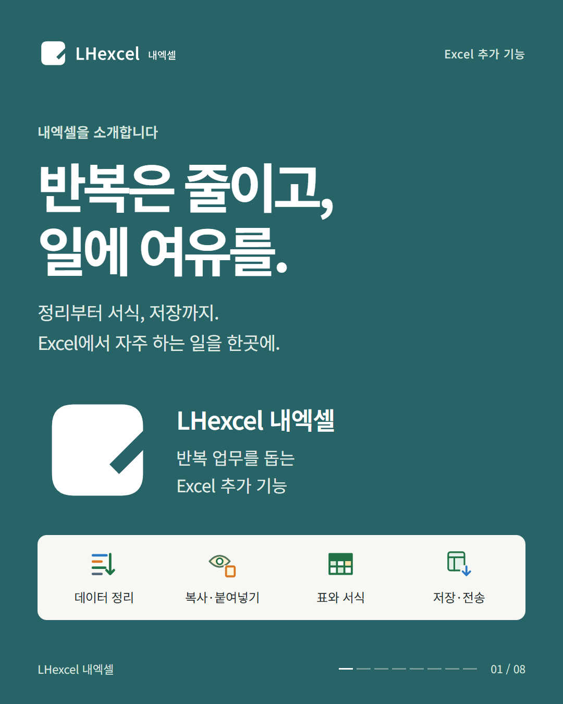
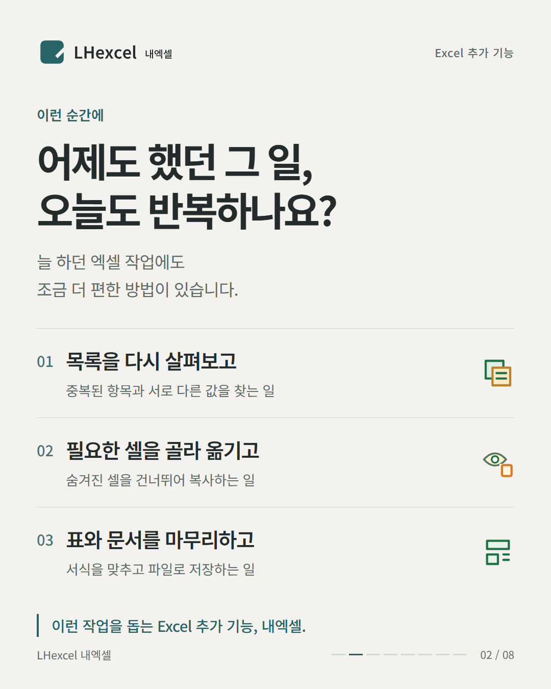
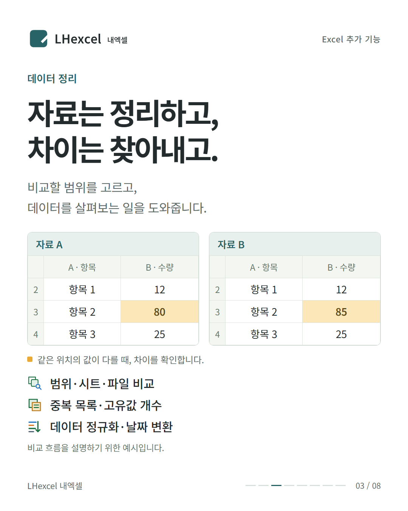
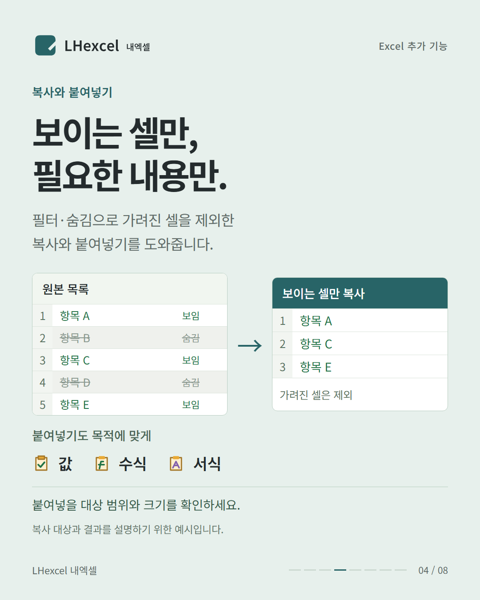
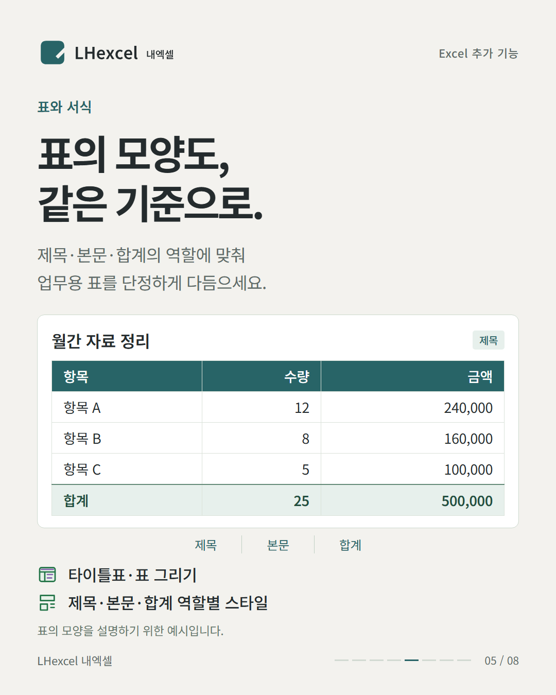
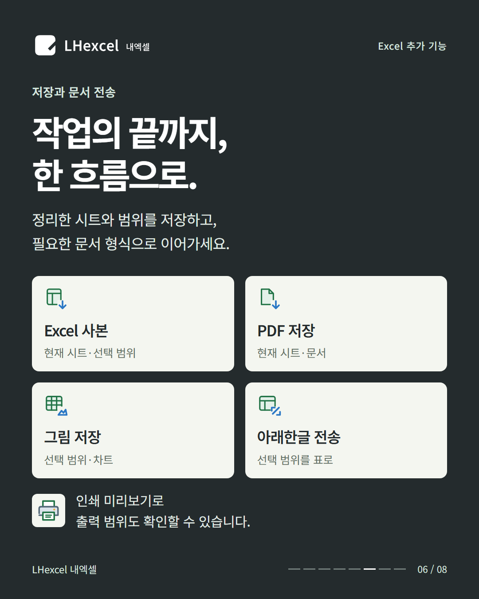
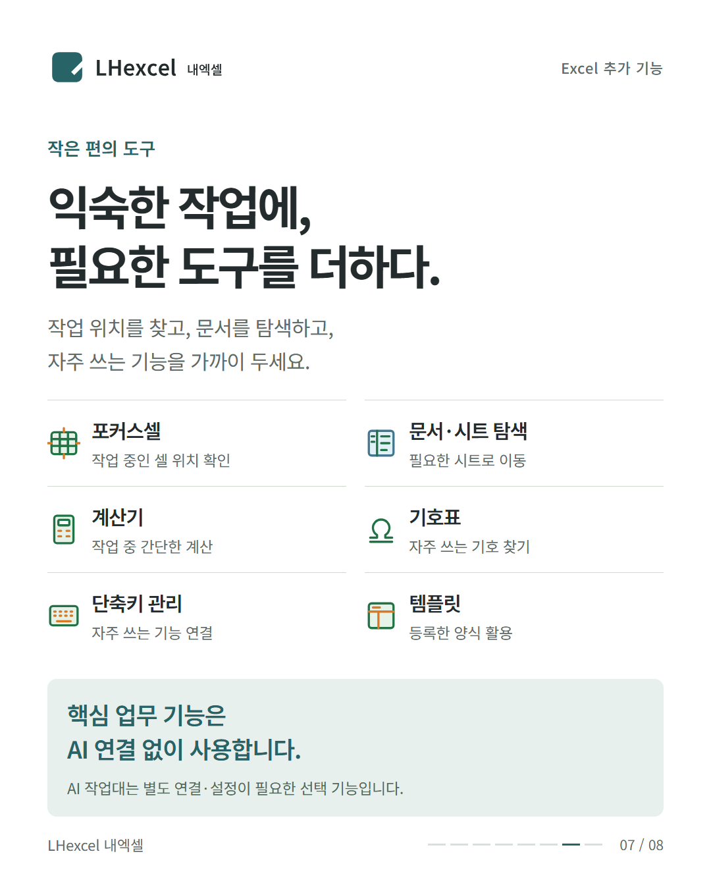
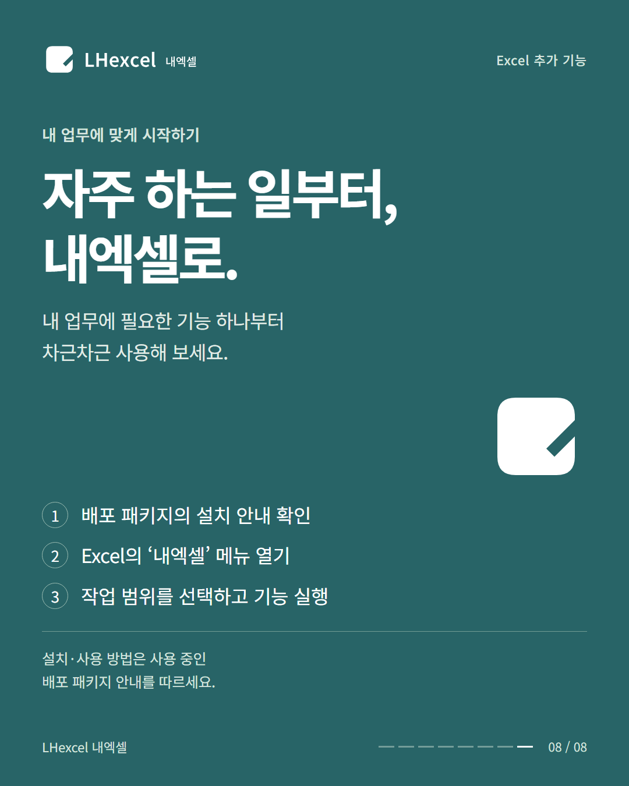

# 내엑셀 소개 카드뉴스

내엑셀이 돕는 반복 업무와 주요 기능을 카드뉴스 8장으로 소개합니다. 각 이미지는 1080 × 1350px PNG입니다.

설치와 기능별 사용 순서는 [내엑셀 사용 안내](../README.md), 다운로드는 [공식 Releases](https://github.com/dru519/LHexcel/releases)를 확인하세요. 프로그램·공개 소스·소개 자료의 이용 조건은 [LICENSE](../LICENSE)를 따릅니다.

## 1. 표지

## 2. 반복업무

## 3. 데이터

## 4. 복사붙여넣기

## 5. 표서식

## 6. 저장전송

## 7. 편의도구

## 8. 시작안내

